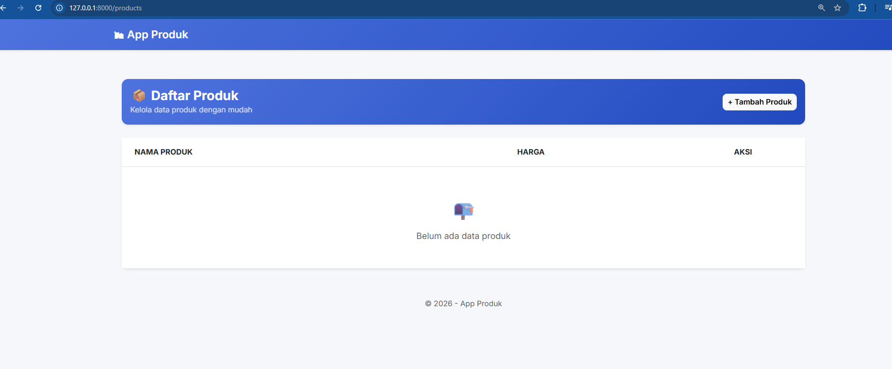
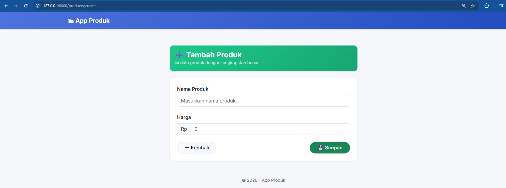
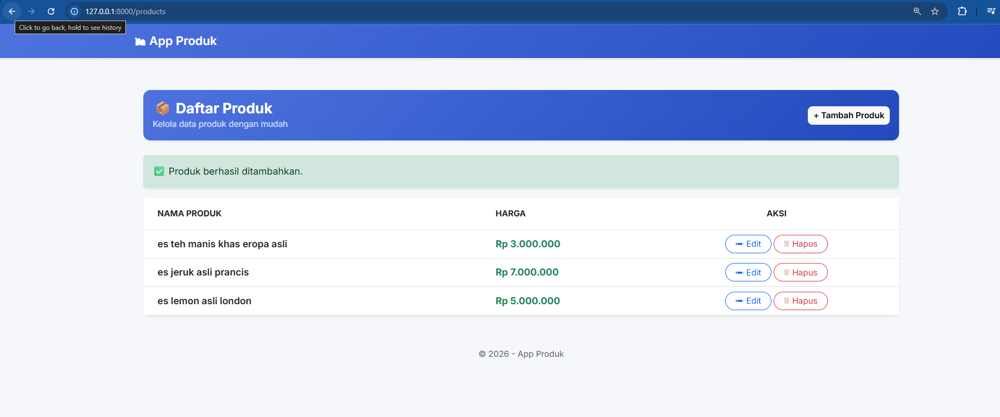
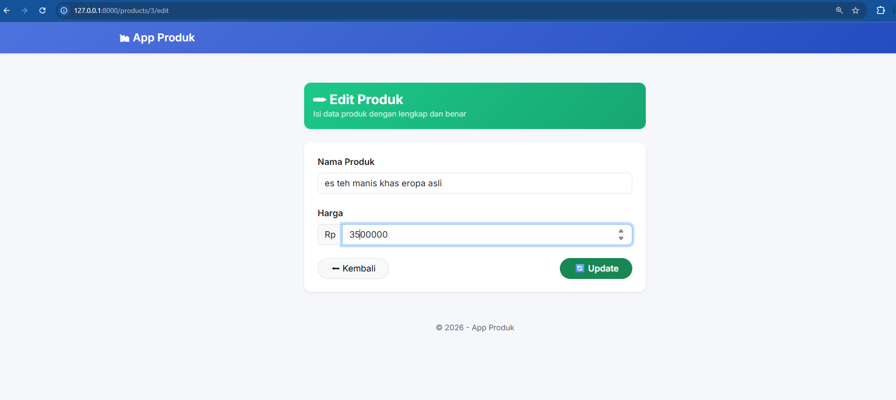

<div align="center">
  <br />

  <h1>LAPORAN PRAKTIKUM <br>
  APLIKASI BERBASIS PLATFORM
  </h1>

  <br />

  <h3>MODUL - 12<br>
  LARAVEL: DATABASE 1 (CRUD)
  </h3>

  <br />

  

  <br />
  <br />
  <br />

  <h3>Disusun Oleh :</h3>

  <p>
    <strong>Aji Tri Prasetyo</strong><br>
    <strong>23111021064</strong><br>
    <strong>S1 IF-11-04</strong>
  </p>

  <br />

  <h3>Dosen Pengampu :</h3>

  <p>
    <strong>Cahyo Prihantoro, S.Kom., M.Eng.</strong>
  </p>
  
  <br />

  <h3>LABORATORIUM HIGH PERFORMANCE
  <br>FAKULTAS INFORMATIKA <br>UNIVERSITAS TELKOM PURWOKERTO <br>2026</h3>
</div>

<hr>

# Dasar Praktikum

Pada praktikum modul 12 ini, mahasiswa ditugaskan untuk mengimplementasikan fungsionalitas manajemen _database_ secara dinamis menggunakan _framework_ Laravel. Praktikum ini berfokus pada penerapan sistem CRUD (_Create, Read, Update, Delete_) melalui arsitektur MVC (_Model-View-Controller_). Sebagai studi kasus, aplikasi yang dibangun merupakan simulasi manajemen katalog _e-commerce_, di mana mahasiswa melakukan manipulasi data secara langsung terhadap tabel entitas `products` dengan standar keamanan _form validation_ dan operasi _database_ berbasis _Object-Relational Mapping_ (ORM).

# Dasar Teori

## 1.1 Konfigurasi Database & Skema

Langkah pertama agar aplikasi web dapat terhubung ke _Database Management System_ (DBMS) adalah melalui pengaturan konfigurasi di berkas _environment_ (`.env`). Laravel memusatkan kredensial sensitif di luar _source code_ utama. Selain itu, Laravel menggunakan fitur _Migration_ sebagai _version control_ untuk skema _database_, yang memungkinkan pembuatan dan modifikasi tabel secara terstruktur lewat kode PHP tanpa harus mengeksekusi SQL manual.

## 1.2 Model & Eloquent ORM

Laravel menyediakan tiga opsi interaksi _database_: _Raw SQL_, _Query Builder_, dan _Eloquent ORM_. Eloquent adalah ORM bawaan yang memetakan tabel _database_ menjadi objek PHP (_Model_). Eloquent memiliki fitur keamanan bawaan bernama _Mass Assignment Protection_. Mekanisme ini mewajibkan pengembang mendefinisikan _property_ `$fillable` untuk menentukan secara eksplisit kolom mana saja yang diizinkan menerima _input_ dari _user_, sehingga mencegah manipulasi kolom sensitif (seperti `id` atau `role_admin`).

## 1.3 Controller

Dalam arsitektur MVC Laravel, _Controller_ menangani alur logika mulai dari penerimaan HTTP _Request_, validasi _input_ data (termasuk tipe data dan restriksi panjang karakter), berinteraksi dengan _Model_ untuk pengolahan _database_, hingga memberikan balikan data (_Response_) ke tampilan antarmuka.

## 1.4 View & Templating (Blade)

_View_ merupakan lapisan representasi antarmuka yang menggunakan _engine_ **Blade**. Blade memiliki kemampuan _templating_ menggunakan _directive_ seperti `@extends`, `@section`, dan `@yield`. Pendekatan ini memungkinkan pembuatan satu struktur _layout_ utama yang dapat digunakan kembali (_reusable_) oleh halaman lain, sehingga kode HTML menjadi efisien dan mudah dikelola.

---

# PENGERJAAN & IMPLEMENTASI SISTEM

Pada proyek ini, dibangun antarmuka manajemen produk _e-commerce_ dengan keamanan ketat untuk menangkis celah kerentanan seperti _SQL Injection_, _Cross-Site Scripting_ (XSS), dan _Cross-Site Request Forgery_ (CSRF).

## 2.1 Arsitektur Data & Alur

Aplikasi menggunakan tabel `products` dengan atribut relasional `name` (string) dan `price` (integer).

| Tahapan Operasi      | Keterangan Implementasi                                                                                                                        |
| -------------------- | ---------------------------------------------------------------------------------------------------------------------------------------------- |
| **Koneksi Database** | Mengubah parameter `DB_DATABASE`, `DB_USERNAME`, dan `DB_PASSWORD` pada `.env`.                                                                |
| **Migration**        | Menjalankan `php artisan make:migration create_products_table` dan mendefinisikan struktur kolom.                                              |
| **Model Security**   | Menambahkan `protected $fillable = ['name', 'price'];` di dalam kelas `Product`.                                                               |
| **Validasi & CRUD**  | `ProductController` memastikan input telah dibersihkan sebelum disimpan ke _database_, menggunakan validasi bawaan HTTP _Request_.             |
| **Blade Templating** | Menyusun struktur hierarki antara `template.blade.php`, `index.blade.php`, dan `form.blade.php`. Mengimplementasikan `@csrf` di setiap _form_. |

## 2.2 Standardisasi Keamanan (Security Best Practices)

- **CSRF Protection:** Laravel secara otomatis mengamankan permintaan jenis POST/PUT/DELETE melalui token rahasia (directive `@csrf`).
- **XSS Protection:** Penggunaan `{{ $data }}` pada Blade secara otomatis mengeksekusi fungsi _htmlentities()_, mengamankan tampilan dari injeksi _script_ berbahaya.
- **Input Validation:** Validasi di lapis _Controller_ secara ketat (`required|min|max`) sebelum data menembus _Model_.

---

## 3. Source Code Praktikum

### 3.1 Konfigurasi _Environment_ (`.env`)

Modifikasi pada bagian koneksi ke MySQL/MariaDB:

```env
DB_CONNECTION=mysql
DB_HOST=127.0.0.1
DB_PORT=3306
DB_DATABASE=ecommerce
DB_USERNAME=root
DB_PASSWORD=
DB_CHARSET=utf8mb4
DB_COLLATION=utf8mb4_unicode_ci
```

### 3.2 File Migration (database/migrations/...\_create_products_table.php)

Mendefinisikan skema secara aman.

```PHP
<?php

use Illuminate\Database\Migrations\Migration;
use Illuminate\Database\Schema\Blueprint;
use Illuminate\Support\Facades\Schema;

return new class extends Migration
{
    public function up(): void
    {
        // Pendefinisian skema dengan tipe data presisi
        // untuk mencegah anomali data
        Schema::create('products', function (Blueprint $table) {
            $table->id();

            // Limitasi panjang karakter string (VARCHAR)
            $table->string('name', 150);

            // Integer default unsigned jika tidak ada harga negatif
            $table->unsignedInteger('price');

            $table->timestamps();
        });
    }

    public function down(): void
    {
        Schema::dropIfExists('products');
    }
};
```

### 3.3 Model Eloquent (app/Models/Product.php)

Penentuan perlindungan Mass Assignment.

```PHP
<?php

namespace App\Models;

use Illuminate\Database\Eloquent\Factories\HasFactory;
use Illuminate\Database\Eloquent\Model;

class Product extends Model
{
    use HasFactory;

    /**
     * Menerapkan filter keamanan tingkat tinggi.
     * Hanya field di bawah ini yang dapat dimanipulasi
     * melalui metode Model::create() atau update().
     * Mencegah injeksi manipulasi field secara tidak sah.
     */
    protected $fillable = [
        'name',
        'price'
    ];
}
```

### 3.4 Controller (app/Http/Controllers/ProductController.php)

Diimplementasikan pembatasan validasi ketat, pengelolaan respons, dan penulisan baris yang ramah baca pada layar kecil.

```PHP
<?php

namespace App\Http\Controllers;

use App\Models\Product;
use Illuminate\Http\Request;
use Illuminate\Support\Facades\Log;

class ProductController extends Controller
{
    public function index()
    {
        // Mengambil keseluruhan data dari database secara aman
        $products = Product::all();

        return view('products.index', [
            'products' => $products
        ]);
    }

    public function create()
    {
        return view('products.form', [
            'title'   => 'Tambah',
            'product' => new Product(),
            'route'   => route('products.store'),
            'method'  => 'POST',
        ]);
    }

    public function store(Request $request)
    {
        // Proteksi Lapis Pertama: Filter validasi input ekstensif
        $validated = $request->validate([
            'name'  => 'required|string|min:4|max:100',
            'price' => 'required|integer|min:1000000',
        ]);

        try {
            // Proteksi Lapis Kedua: Mass-assignment berbasis fillable
            Product::create($validated);

            return redirect()
                ->route('products.index')
                ->with('success', 'Produk berhasil ditambahkan.');

        } catch (\Exception $e) {
            // Log ke sistem, jangan melempar SQL trace ke sisi client
            Log::error('Product creation failed: ' . $e->getMessage());

            return back()
                ->withInput()
                ->with('error', 'Terjadi kegagalan sistem penyimpanan.');
        }
    }

    public function edit(Product $product)
    {
        // Data binding Eloquent akan otomatis mencari objek
        // berdasarkan parameter ID pada URI.
        return view('products.form', [
            'title'   => 'Edit',
            'product' => $product,
            'route'   => route('products.update', $product),
            'method'  => 'PUT',
        ]);
    }

    public function update(Request $request, Product $product)
    {
        $validated = $request->validate([
            'name'  => 'required|string|min:4|max:100',
            'price' => 'required|integer|min:1000000',
        ]);

        try {
            $product->update($validated);

            return redirect()
                ->route('products.index')
                ->with('success', 'Produk berhasil diperbarui.');

        } catch (\Exception $e) {
            Log::error('Product update failed: ' . $e->getMessage());

            return back()
                ->withInput()
                ->with('error', 'Pembaruan data produk gagal.');
        }
    }

    public function destroy(Product $product)
    {
        try {
            $product->delete();

            return redirect()
                ->route('products.index')
                ->with('success', 'Produk berhasil dihapus permanen.');

        } catch (\Exception $e) {
            Log::error('Product deletion failed: ' . $e->getMessage());

            return redirect()
                ->route('products.index')
                ->with('error', 'Data tidak dapat dihapus.');
        }
    }
}
```

### 3.5 Layout Template Induk (resources/views/template.blade.php)

```HTML
<!DOCTYPE html>
<html lang="id">

<head>
    <meta charset="UTF-8">
    <meta name="viewport" content="width=device-width, initial-scale=1.0">
    <title>@yield('title') | App Produk</title>

    {{-- GOOGLE FONT --}}
    <link href="https://fonts.googleapis.com/css2?family=Inter:wght@300;400;600;700&display=swap" rel="stylesheet">

    {{-- BOOTSTRAP --}}
    <link href="https://cdn.jsdelivr.net/npm/bootstrap@5.3.0/dist/css/bootstrap.min.css" rel="stylesheet">

    {{-- CUSTOM STYLE --}}
    <style>
        body {
            font-family: 'Inter', sans-serif;
            background-color: #f5f7fb;
        }

        .navbar {
            background: linear-gradient(135deg, #4e73df, #224abe);
        }

        .navbar-brand {
            font-weight: 600;
            color: #fff !important;
        }

        .content-wrapper {
            padding: 30px 15px;
        }

        .card {
            border-radius: 12px;
        }

        .btn {
            border-radius: 8px;
        }
    </style>
</head>

<body>

    {{-- NAVBAR --}}
    <nav class="navbar navbar-expand-lg shadow-sm">
        <div class="container">
            <a class="navbar-brand" href="{{ route('products.index') }}">
                🛍 App Produk
            </a>
        </div>
    </nav>

    {{-- CONTENT --}}
    <div class="container content-wrapper">
        @yield('content')
    </div>

    {{-- FOOTER --}}
    <footer class="text-center text-muted small pb-3">
        © {{ date('Y') }} - App Produk
    </footer>

    {{-- BOOTSTRAP JS --}}
    <script src="https://cdn.jsdelivr.net/npm/bootstrap@5.3.0/dist/js/bootstrap.bundle.min.js"></script>

</body>

</html>
```

### 3.6 Tampilan Daftar Produk (resources/views/products/index.blade.php)

```HTML
@extends('template')

@section('title', 'Daftar Produk')

@section('content')
   <div class="container py-4">

        {{-- HEADER --}}
        <div class="card border-0 shadow-sm mb-4" style="background: linear-gradient(135deg, #4e73df, #224abe);">
            <div class="card-body d-flex justify-content-between align-items-center text-white">
                <div>
                    <h4 class="mb-0 fw-bold">📦 Daftar Produk</h4>
                    <small class="opacity-75">Kelola data produk dengan mudah</small>
                </div>
                <a href="{{ route('products.create') }}" class="btn btn-light btn-sm fw-semibold">
                    + Tambah Produk
                </a>
            </div>
        </div>

        {{-- ALERT --}}
        @if (session('success'))
            <div class="alert alert-success border-0 shadow-sm">
                ✅ {{ session('success') }}
            </div>
        @endif

        {{-- TABLE --}}
        <div class="card border-0 shadow-sm">
            <div class="card-body p-0">

                <div class="table-responsive">
                    <table class="table table-hover align-middle mb-0">

                        <thead style="background-color: #f8f9fc;">
                            <tr class="text-secondary small text-uppercase">
                                <th class="px-4 py-3">Nama Produk</th>
                                <th class="py-3">Harga</th>
                                <th class="text-center py-3">Aksi</th>
                            </tr>
                        </thead>

                        <tbody>
                            @forelse ($products as $product)
                                <tr>
                                    <td class="px-4 fw-semibold">
                                        {{ $product->name }}
                                    </td>

                                    <td class="text-success fw-bold">
                                        Rp {{ number_format($product->price, 0, ',', '.') }}
                                    </td>

                                    <td class="text-center">
                                        <a href="{{ route('products.edit', $product->id) }}"
                                            class="btn btn-sm btn-outline-primary rounded-pill px-3">
                                            ✏ Edit
                                        </a>

                                        <form method="POST" action="{{ route('products.destroy', $product->id) }}"
                                            class="d-inline" onsubmit="return confirm('Hapus data ini?')">
                                            @csrf
                                            @method('DELETE')

                                            <button class="btn btn-sm btn-outline-danger rounded-pill px-3">
                                                🗑 Hapus
                                            </button>
                                        </form>
                                    </td>
                                </tr>
                            @empty
                                <tr>
                                    <td colspan="3" class="text-center text-muted py-5">
                                        <div class="d-flex flex-column align-items-center">
                                            <span style="font-size: 40px;">📭</span>
                                            <span class="mt-2">Belum ada data produk</span>
                                        </div>
                                    </td>
                                </tr>
                            @endforelse
                        </tbody>

                    </table>
                </div>

            </div>
        </div>

    </div>
@endsection
```

### 3.7 Tampilan Form Terpadu (resources/views/products/form.blade.php)

```HTML
@extends('template')

@section('title', 'Form ' . $title . ' Produk')

@section('content')
    <div class="container py-4">

        <div class="row justify-content-center">
            <div class="col-md-6">

                {{-- HEADER --}}
                <div class="card border-0 shadow-sm mb-4" style="background: linear-gradient(135deg, #1cc88a, #17a673);">
                    <div class="card-body text-white">
                        <h4 class="mb-0 fw-bold">
                            {{ $title == 'Tambah' ? '➕ Tambah Produk' : '✏ Edit Produk' }}
                        </h4>
                        <small class="opacity-75">
                            Isi data produk dengan lengkap dan benar
                        </small>
                    </div>
                </div>

                {{-- CARD FORM --}}
                <div class="card border-0 shadow-sm">
                    <div class="card-body p-4">

                        <form method="POST" action="{{ $route }}">
                            @csrf

                            @if ($method === 'PUT')
                                @method('PUT')
                            @endif

                            {{-- NAMA --}}
                            <div class="mb-4">
                                <label class="form-label fw-semibold">Nama Produk</label>
                                <input type="text" name="name" placeholder="Masukkan nama produk..."
                                    class="form-control rounded-3 @error('name') is-invalid @enderror"
                                    value="{{ old('name', $product->name) }}">

                                @error('name')
                                    <div class="invalid-feedback">
                                        {{ $message }}
                                    </div>
                                @enderror
                            </div>

                            {{-- HARGA --}}
                            <div class="mb-4">
                                <label class="form-label fw-semibold">Harga</label>
                                <div class="input-group">
                                    <span class="input-group-text">Rp</span>
                                    <input type="number" name="price" placeholder="0"
                                        class="form-control rounded-end-3 @error('price') is-invalid @enderror"
                                        value="{{ old('price', $product->price) }}">
                                </div>

                                @error('price')
                                    <div class="invalid-feedback d-block">
                                        {{ $message }}
                                    </div>
                                @enderror
                            </div>

                            {{-- BUTTON --}}
                            <div class="d-flex justify-content-between align-items-center mt-4">

                                <a href="{{ route('products.index') }}" class="btn btn-light border rounded-pill px-4">
                                    ⬅ Kembali
                                </a>

                                <button type="submit" class="btn btn-success rounded-pill px-4 fw-semibold">
                                    {{ $title == 'Tambah' ? '💾 Simpan' : '🔄 Update' }}
                                </button>

                            </div>

                        </form>

                    </div>
                </div>

            </div>
        </div>

    </div>
@endsection
```

HASIL TAMPILAN WEB (OUTPUT)
Berikut adalah dokumentasi tangkapan layar (screenshot) implementasi operasi keamanan lapis database dan manipulasi UI menggunakan fungsionalitas CRUD di framework Laravel:

1. Tampilan Halaman View (Awal)
   Deskripsi: Menampilkan struktur tabel produk utama dengan status direktori kosong sebelum diisi data. Rute URI: http://localhost:8000/products.
    <p align="center">
    
    </p>

2. Tampilan Halaman Form Tambah Produk
   Deskripsi: Antarmuka terproteksi CSRF untuk memasukkan entitas data "Laptop" beserta limitasi harganya. Terdapat indikator peringatan divalidasi langsung oleh Controller. Rute URI: http://localhost:8000/products/create.
    <p align="center">
    
    </p>

3. Tampilan Halaman View Setelah Tambah Data
   Deskripsi: Visualisasi tabel merender balikan data baru ke antarmuka dengan injeksi notifikasi session flash data "berhasil ditambahkan". Rute URI: http://localhost:8000/products.
    <p align="center">
    
    </p>

4. Tampilan Halaman Form Edit Produk
   Deskripsi: Form dengan repopulasi data Eloquent secara otomatis. Parameter method spoofing PUT diaktifkan agar integrasi pembaruan dikenali oleh Laravel Routing. Rute URI: http://localhost:8000/products/[id]/edit.
    <p align="center">
    
    </p>
