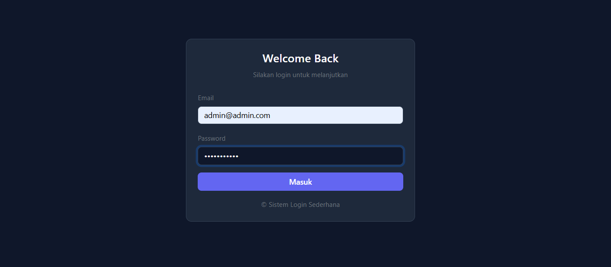
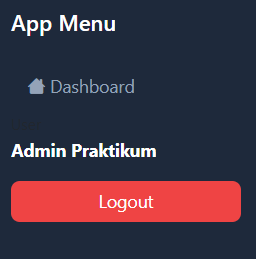
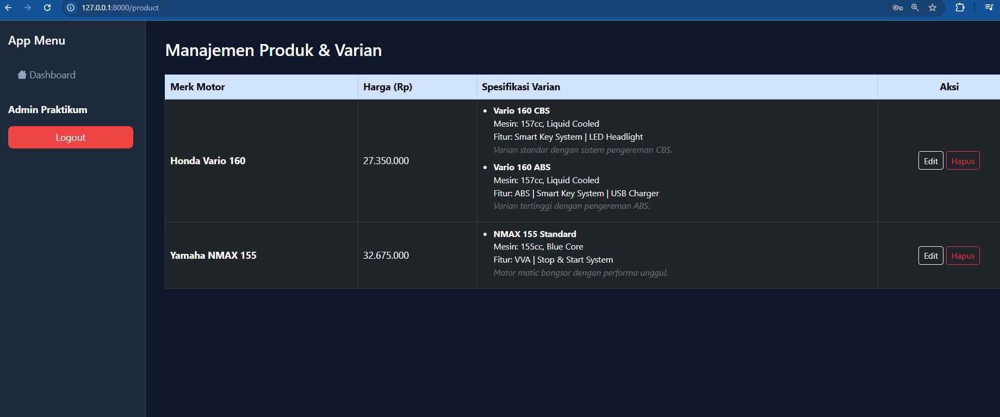
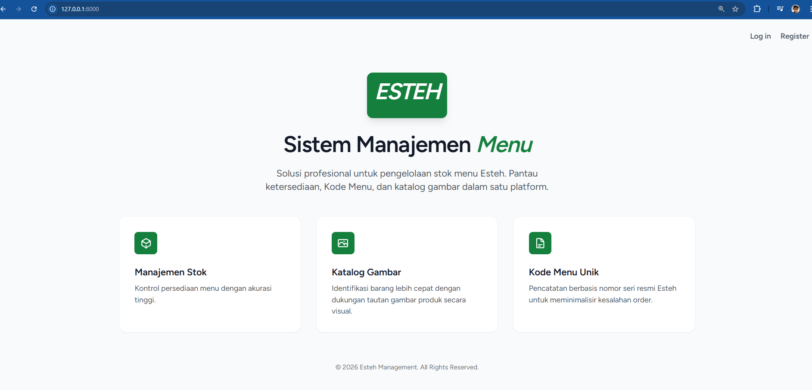
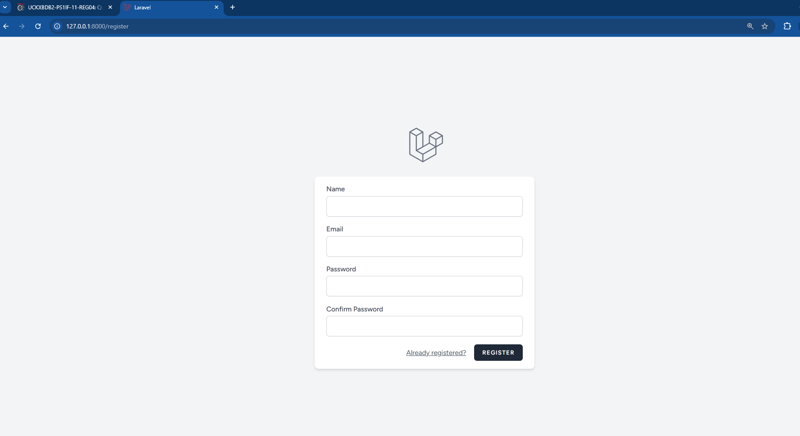
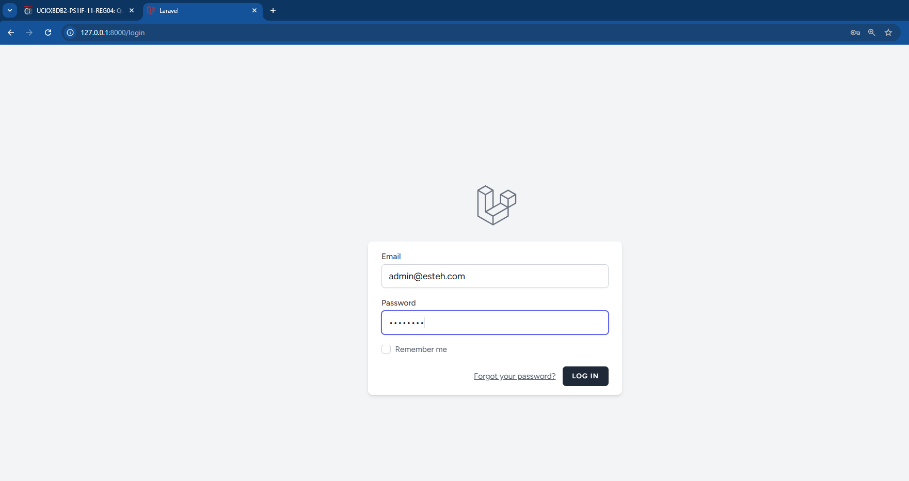
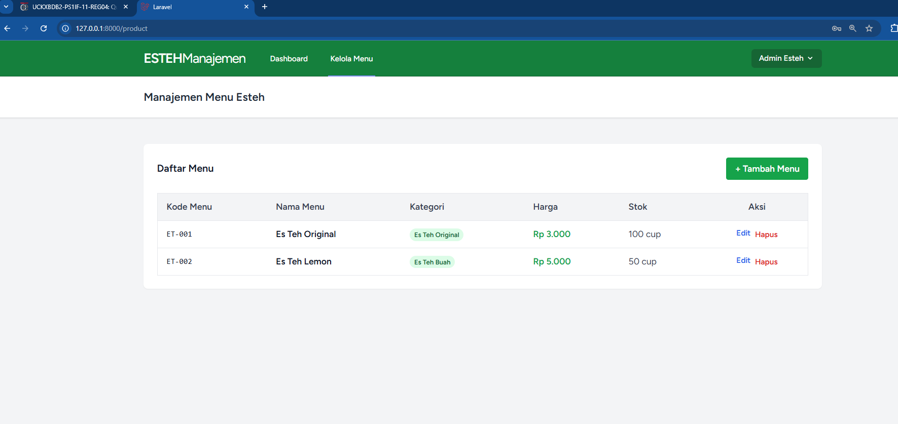
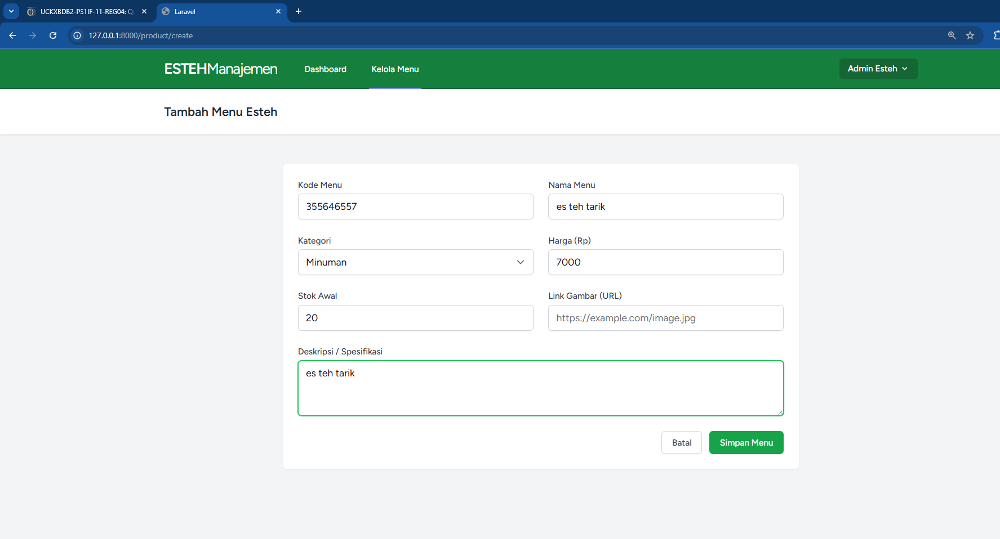
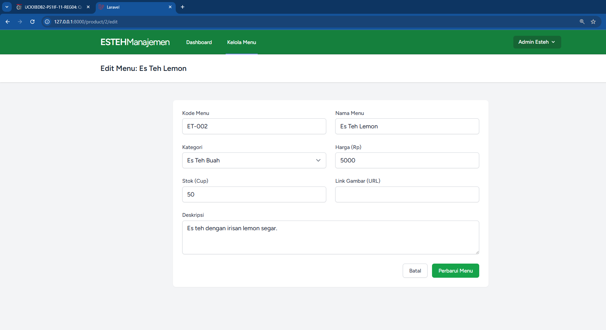

<div align="center">
  <br />

  <h1>LAPORAN PRAKTIKUM <br>
  APLIKASI BERBASIS PLATFORM
  </h1>

  <br />

  <h3>MODUL - 13<br>
  LARAVEL: DATABASE 2 (AUTH, MIDDLEWARE & RELATIONS)
  </h3>

  <br />

  

  <br />
  <br />
  <br />

  <h3>Disusun Oleh :</h3>

  <p>
    <strong>Aji Tri Prasetyo</strong><br>
    <strong>2311102064</strong><br>
    <strong>S1 IF-11-04</strong>
  </p>

  <br />

  <h3>Dosen Pengampu :</h3>

  <p>
    <strong>Cahyo Prihantoro, S.Kom., M.Eng.</strong>
  </p>
  
  <br />

  <h3>LABORATORIUM HIGH PERFORMANCE
  <br>FAKULTAS INFORMATIKA <br>UNIVERSITAS TELKOM PURWOKERTO <br>2026</h3>
</div>

<hr>

# Dasar Praktikum

Pada praktikum modul 13 ini, fokus pengembangan bergeser menuju eskalasi keamanan akses dan perancangan arsitektur _database_ yang lebih kompleks. Mahasiswa ditugaskan untuk mengimplementasikan sistem _Authentication_ (Login/Logout), manajemen sesi (_Session_), pembatasan akses (_Middleware_), serta menghubungkan antar-entitas data menggunakan skema relasi _One-to-Many_ melalui Eloquent ORM di _framework_ Laravel.

# Dasar Teori

## 1.1 Manajemen Session

_Session_ adalah mekanisme penyimpanan data sementara di sisi server yang terikat pada interaksi pengguna tertentu. Laravel mendukung dua tipe sesi:

- **Session Reguler:** Bertahan selama sesi peramban aktif atau hingga waktu kedaluwarsa habis (misal: menyimpan status login, nama _user_).
- **Session Flash:** Hanya bertahan untuk satu siklus _HTTP Request_ berikutnya sebelum otomatis terhapus (misal: notifikasi _success/error_ saat _redirect_).

## 1.2 Keamanan Berlapis via Middleware & Auth

_Middleware_ berfungsi sebagai pos pemeriksaan (_checkpoint_) yang menyaring setiap _HTTP Request_ yang masuk. Jika suatu _route_ diproteksi _Middleware Auth_, pengguna yang belum melalui proses otentikasi akan otomatis ditolak dan diarahkan ke halaman _Login_. Proses validasi kredensial sendiri difasilitasi oleh `Auth` _facade_, sebuah pustaka terintegrasi Laravel yang memvalidasi _email_ dan _password_ yang telah terenkripsi (di-_hash_ menggunakan algoritma _Bcrypt_).

## 1.3 Model Relasi (Eloquent Relationships)

Aplikasi tingkat lanjut tidak mungkin berdiri hanya dengan tabel-tabel terisolasi. Laravel Eloquent menyederhanakan _Join_ antar tabel menggunakan _Object-Oriented syntax_. Konsep _One-to-Many_ (Satu-ke-Banyak) diterapkan di sini; di mana satu objek `Product` dapat memiliki banyak objek `Variant` (dikendalikan dengan `hasMany`), sedangkan setiap `Variant` dipastikan hanya merujuk pada satu `Product` secara spesifik (dikendalikan dengan `belongsTo`).

---

# PENGERJAAN & IMPLEMENTASI SISTEM

Penerapan pada modul ini menitikberatkan pada perancangan logika keamanan di sisi server dan interkoneksi entitas data agar tetap solid meski diakses oleh berbagai profil _user_.

## 2.1 Skema Autentikasi

Akses ke menu pengelolaan produk kini dikunci sepenuhnya.

| Komponen                       | Implementasi Logika                                                                                                                                 |
| ------------------------------ | --------------------------------------------------------------------------------------------------------------------------------------------------- |
| **Routing**                    | URL `/product` disematkan `->middleware('auth')`. Pemanggilan _route_ login diberi nama alias `name('login')` sebagai rujukan standar _Middleware_. |
| **Pengecekan (Auth::check)**   | Jika _user_ sudah masuk, URL `/login` akan langsung memantulkannya ke _dashboard_ produk untuk mencegah _bypass_ logika.                            |
| **Otentikasi (Auth::attempt)** | Membandingkan secara aman _input_ _form_ dengan _hash Bcrypt_ yang tersimpan di basis data tanpa perlu mendeskripsi _password_ secara paksa.        |

## 2.2 Relasi Entitas Database (One-to-Many)

Tabel pendukung `variants` dibuat dengan menjaga integritas data menggunakan `foreignId` yang dirangkai dengan `constrained()`. Parameter ini memastikan pada level RDBMS bahwa _ID_ produk yang disematkan ke dalam varian benar-benar ada di tabel referensi. Pemanggilan data varian ke antarmuka juga dieksekusi secara efisien menggunakan pendekatan hierarki objek di Blade.

---

## 3. Source Code Praktikum

> **Catatan Engineer:** Desain sistem relasional dan autentikasi wajib mematuhi standar _Clean Architecture_. Kode di bawah memastikan proteksi ketat pada _route_, penggunaan koneksi _database_ secara bijak, dan limitasi penulisan sintaks agar ramah pada monitor portabel (14 inci).

### 3.1 Perlindungan Rute (Routing - `routes/web.php`)

Pengaturan alur lalu lintas _request_, mendaftarkan fungsi otentikasi, serta memberikan tameng _middleware_ pada rute esensial.

```php
<?php

use Illuminate\Support\Facades\Route;
use Illuminate\Support\Facades\Auth;
use App\Http\Controllers\SiteController;
use App\Http\Controllers\ProductController;

Route::get('/', function () {
    return redirect('/product');
});

// Rute Tampilan Login dengan pengecekan sesi aktif
Route::get('/login', function () {
    if (Auth::check()) {
        return redirect('/product');
    }
    return view('login');
})->name('login');

// Rute Eksekusi Login (Submit Form)
Route::post('/login', [SiteController::class, 'auth'])->name('login.post');

// Rute Pemusnahan Sesi (Logout)
Route::get('/logout', function () {
    Auth::logout();

    // Invalidate sesi secara total guna memitigasi Session Fixation Attack
    session()->invalidate();
    session()->regenerateToken();

    return redirect('/login');
})->name('logout');

// Rute CRUD Product diproteksi penuh oleh Middleware Auth
Route::resource('product', ProductController::class)->middleware('auth');

```

### 3.2 Lapisan Pengendali Keamanan (app/Http/Controllers/SiteController.php)

Memvalidasi masukan form login dengan standar eksekusi sistem bawaan (Auth Attempt).

```PHP
<?php

namespace App\Http\Controllers;

use Illuminate\Http\Request;
use Illuminate\Support\Facades\Auth;
use Illuminate\Support\Facades\Log;

class SiteController extends Controller
{
    public function auth(Request $request)
    {
        // Limitasi input awal agar request tidak membebani memori
        $credentials = $request->validate([
            'email'    => 'required|email|max:150',
            'password' => 'required|string|min:6',
        ]);

        try {
            // Auth::attempt melakukan pencocokan hash Bcrypt di latar belakang
            if (Auth::attempt(['email' => $request->email, 'password' => $request->password])) {

                $request->session()->regenerate();

                // Menyimpan nama user ke session statis sebagai fallback/display
                session()->put('name', Auth::user()->name);

                return redirect()->intended('/product');
            }

            // Fallback apabila kredensial salah (tidak spesifik memberitahu mana yang salah)
            return redirect('/login')
                ->with('msg', 'Otentikasi gagal: Email atau Password tidak valid.');

        } catch (\Exception $e) {
            Log::error('Kesalahan Otentikasi Lintas Sistem: ' . $e->getMessage());
            return redirect('/login')->with('msg', 'Terjadi kesalahan internal server.');
        }
    }
}

```

### 3.3 Skema Migrasi Relasional (database/migrations/...\_create_variants_table.php)

Membuat tabel detail produk yang dikunci secara struktural ke tabel induk.

```PHP
<?php

use Illuminate\Database\Migrations\Migration;
use Illuminate\Database\Schema\Blueprint;
use Illuminate\Support\Facades\Schema;

return new class extends Migration
{
    public function up(): void
    {
        Schema::create('variants', function (Blueprint $table) {
            $table->id();

            // Atribut Variabel
            $table->string('name', 100);
            $table->text('description')->nullable();
            $table->string('mesin', 100);
            $table->string('fitur', 255);

            // Relasi Foreign Key dengan referensi tabel `products`
            // onDelete('cascade') opsional: jika produk dihapus, variannya terhapus otomatis
            $table->foreignId('product_id')
                  ->constrained('products')
                  ->onDelete('cascade');

            $table->timestamps();
        });
    }

    public function down(): void
    {
        Schema::dropIfExists('variants');
    }
};
```

### 3.4 Representasi Model Relasional ORM

Model Product.php (Posisi Induk):

```PHP
<?php

namespace App\Models;

use Illuminate\Database\Eloquent\Factories\HasFactory;
use Illuminate\Database\Eloquent\Model;

class Product extends Model
{
    use HasFactory;

    protected $fillable = ['name', 'price'];

    // Menandakan 1 Produk berhak memiliki banyak Varian
    public function variants()
    {
        return $this->hasMany(Variant::class);
    }
}
```

Model Variant.php (Posisi Anak):

```PHP
<?php

namespace App\Models;

use Illuminate\Database\Eloquent\Factories\HasFactory;
use Illuminate\Database\Eloquent\Model;

class Variant extends Model
{
    use HasFactory;

    // Melindungi Mass-Assignment
    protected $fillable = [
        'name', 'description', 'processor',
        'memory', 'storage', 'product_id'
    ];

    // Menandakan spesifikasi Varian ini merupakan milik 1 Produk mutlak
    public function product()
    {
        return $this->belongsTo(Product::class);
    }
}
```

### 3.5 Pembaruan Layout Template Induk (resources/views/template.blade.php)

Menggunakan directive Blade @auth untuk mendeteksi visibilitas menu berdasarkan sesi.

```HTML
<!DOCTYPE html>
<html lang="en">

<head>
    <meta charset="UTF-8">
    <meta name="viewport" content="width=device-width, initial-scale=1.0">
    <title>@yield('title')</title>
    <link href="https://cdn.jsdelivr.net/npm/bootstrap@5.3.0/dist/css/bootstrap.min.css" rel="stylesheet">
    <link rel="stylesheet" href="https://cdn.jsdelivr.net/npm/bootstrap-icons@1.10.0/font/bootstrap-icons.css">

    <style>
        body {
            background: #0f172a;
            color: #f8fafc;
            font-family: 'Segoe UI', sans-serif;
            min-height: 100vh;
        }

        .sidebar {
            width: 250px;
            background: #1e293b;
            height: 100vh;
            position: fixed;
            padding: 20px;
            border-right: 1px solid #334155;
        }

        .content-area {
            margin-left: 250px;
            padding: 2rem;
        }

        .nav-link {
            color: #94a3b8;
            padding: 10px 15px;
            border-radius: 8px;
            text-decoration: none;
            display: block;
        }

        .nav-link:hover {
            background: #334155;
            color: white;
        }

        .btn-logout {
            background: #ef4444;
            color: white;
            border-radius: 8px;
            width: 100%;
        }
    </style>
</head>

<body>

    @auth
    <div class="sidebar">
        <h5 class="text-white mb-4">App Menu</h5>
        <div class="mb-auto">
            <a href="#" class="nav-link"><i class="bi bi-house"></i> Dashboard</a>
        </div>
        <div class="mt-auto">
            <div class="mb-3">
                <small class="text-muted">User</small>
                <div class="text-white fw-bold">{{ Auth::user()->name }}</div>
            </div>
            <a href="{{ route('logout') }}" class="btn btn-logout">Logout</a>
        </div>
    </div>
    @endauth

    <div class="content-area">
        @yield('content')
    </div>

    <script src="https://cdn.jsdelivr.net/npm/bootstrap@5.3.0/dist/js/bootstrap.bundle.min.js"></script>
</body>

</html>
```

### 3.6 Modifikasi Tampilan Tabel dengan Nested Data (resources/views/products/index.blade.php)

Menarik data relasional secara dinamis dari Model ke layar antarmuka pengguna.

```HTML
 @extends('template')
@section('title', 'Daftar Produk')

@section('content')
<div class="col-md-12">
    <h3 class="mb-4 text-white">Manajemen Produk & Varian</h3>
    <div class="table-responsive">
        <table class="table table-dark table-hover table-bordered shadow-sm">
            <thead class="table-primary">
                <tr>
                    <th>Merk Motor</th>
                    <th>Harga (Rp)</th>
                    <th>Spesifikasi Varian</th>
                    <th class="text-center">Aksi</th>
                </tr>
            </thead>
            <tbody>
                @foreach ($products as $d)
                <tr>
                    <td class="align-middle fw-bold">{{ $d->name }}</td>
                    <td class="align-middle">{{ number_format($d->price, 0, ',', '.') }}</td>

                    <td class="align-middle">
                        <ul class="mb-0 text-light" style="font-size: 0.9em; padding-left: 1.2rem;">
                            @foreach ($d->variants as $var)
                                <li class="mb-2">
                                    <strong class="text-white">{{ $var->name }}</strong><br>
                                    Mesin: {{ $var->mesin }} <br>
                                    Fitur: {{ $var->fitur }} <br>
                                    <span class="fst-italic text-secondary">{{ $var->description }}</span>
                                </li>
                            @endforeach
                        </ul>
                    </td>

                    <td class="align-middle text-center">
                        <button class="btn btn-sm btn-outline-light">Edit</button>
                        <button class="btn btn-sm btn-outline-danger">Hapus</button>
                    </td>
                </tr>
                @endforeach
                @if($products->isEmpty())
                <tr>
                    <td colspan="4" class="text-center py-4 text-muted">Belum ada data produk tersedia.</td>
                </tr>
                @endif
            </tbody>
        </table>
    </div>
</div>
@endsection

```

HASIL TAMPILAN WEB (OUTPUT)
Berikut adalah dokumentasi tangkapan layar (screenshot) implementasi operasi keamanan logikal dan pemanggilan kerangka data berelasi (Database Relational Mapping):

1. Tampilan Halaman Login (Proteksi Awal)
   Deskripsi: Menampilkan form masuk yang wajib diisi. Apabila URL /product dipaksa diakses tanpa sesi, pengguna akan selalu terpantul ke halaman ini oleh Middleware.
   

2. Tampilan Header Auth di Layout Global
   Deskripsi: Visualisasi directive @auth yang berhasil mengidentifikasi nama user yang sedang login beserta ketersediaan tombol eksekusi "Logout Keamanan".
   

3. Tampilan Halaman Daftar Produk & Varian (One-to-Many Output)
   Deskripsi: Visualisasi dari arsitektur Object-Relational Mapping yang merender kumpulan atribut turunan variants langsung berdampingan dengan entitas induk products secara struktural.
   

# TUGAS PERTEMUAN 8

1. jelaskan tentang git branch

- apa itu git branch
- buatlah git branch dengan 2 akun berbeda dan hubungkan dengan project yang di buat di tugas 2 ( bisa dengan antar teman kelas
- kalian jelaskan apa saja fungsi nya dan apa keuntungan git branch
- buat juga output dan input apa saja yang dapat kalian lakukan mengunakan git branch

2. buatlah website ( bisa mengunakan website yang di gunnakan dalam tubes ) , lalu tambahkan database yang terhubung dengan local house

## JAWAB

### 1. git branch

- Git branch adalah fitur dalam Git yang berfungsi menciptakan ruang kerja terpisah (cabang) dari repositori utama (main/master). Ini memungkinkan pengembang bereksperimen, memperbaiki bug, atau menambahkan fitur baru tanpa memengaruhi kode utama yang stabil. Branch bertindak sebagai pointer ringan yang bergerak otomatis setiap ada commit.
-
- Fungsi dan Keuntungan Git Branch
  - Fungsi Utama:
    Isolasi Kode: Memisahkan pekerjaan yang sedang berjalan dari kode utama yang sudah stabil (production-ready).
    Kolaborasi Tim: Memungkinkan banyak developer mengerjakan fitur yang berbeda-beda di dalam satu proyek yang sama pada waktu yang bersamaan.
    Manajemen Rilis: Memisahkan versi aplikasi (misalnya: branch untuk development, testing, dan production).

  - Keuntungan Menggunakan Git Branch:
    Aman dari Error Fatal: Jika kodingan di branch baru ternyata error atau berantakan, kode di branch utama (main) tidak akan terpengaruh sama sekali.
    Pengembangan Paralel: Kamu dan temanmu bisa bekerja di detik yang sama, mengedit file yang sama, tanpa harus saling tunggu.
    Code Review Lebih Rapi: Memudahkan proses pengecekan kode sebelum digabungkan (biasanya melalui proses Pull Request / Merge Request).
    Mudah Berpindah Konteks: Kamu bisa lompat dari mengerjakan "Fitur A" ke "Perbaikan Bug B" hanya dengan berganti branch, tanpa perlu membuat folder project baru di laptop.

-

### 2. Website

# Sistem Manajemen Showroom & Inventaris Honda (Tugas 8)

Proyek ini dibangun menggunakan Laravel 11 dan ditujukan untuk mengimplementasikan manajemen basis data relasional (MySQL) dengan skema autentikasi komprehensif dari bawaan Laravel Breeze.

Aplikasi ini dikhususkan untuk toko retail/gudang dan telah di-desain menggunakan Tailwind CSS untuk menawarkan User Experience (UX) premium melalui desain Glassmorphism, palet gradien profesional, dan visualisasi Dashboard interaktif.

## Fitur Unggulan

1. Gatekeeper Security: Seluruh data unit dan pelanggan terlindungi; akses hanya diberikan kepada staf terverifikasi.
2. Performance Dashboard: Panel kendali utama yang menampilkan Total Unit Ready, Estimasi Nilai Aset (OTR), dan Status Indent.
3. Inventory Alert: Indikator otomatis untuk suku cadang fast-moving yang menipis atau unit kendaraan dengan stok terbatas (Low Stock Alert).
4. Aesthetic Branding: Penggunaan aset visual honda1.png hingga honda6.png dalam grid asimetris, memberikan impresi katalog digital premium dengan animasi halus.

---

## 💻 Source Code Inti Sistem

_Berikut adalah representasi kode esensial (MVC) yang digunakan di dalam `modul-13/tugas-8`._

### 1. File Konfigurasi Lintas Server (`.env`)

Diatur pada modul ini agar merujuk ke layanan **MySQL Laragon** dengan basis data `sembako_db`.

```env
DB_CONNECTION=mysql
DB_HOST=127.0.0.1
DB_PORT=3306
DB_DATABASE=honda_db
DB_USERNAME=root
DB_PASSWORD=tegal
```

### 2. Algoritme Pengendali Rute (routes/web.php)

Mengarahkan tamu aplikasi langsung ke landing page, sementara kontrol manajemen dilindungi berlapis oleh alias validasi auth.

```php
<?php

use App\Http\Controllers\ProfileController;
use App\Http\Controllers\ProductController;
use Illuminate\Support\Facades\Route;

Route::get('/', function () {
    return view('welcome');
});

Route::get('/dashboard', function () {
    return redirect()->route('product.index');
})->middleware(['auth', 'verified'])->name('dashboard');

Route::middleware('auth')->group(function () {
    Route::resource('product', ProductController::class);

    Route::get('/profile', [ProfileController::class, 'edit'])->name('profile.edit');
    Route::patch('/profile', [ProfileController::class, 'update'])->name('profile.update');
    Route::delete('/profile', [ProfileController::class, 'destroy'])->name('profile.destroy');
});

require __DIR__.'/auth.php';
```

### 3. Migrasi DDL Database (database/migrations/...\_create_products_table.php)

Mendefinisikan skema kolom pendataan barang sembako langsung ke MariaDB/MySQL.

```php
<?php

use Illuminate\Database\Migrations\Migration;
use Illuminate\Database\Schema\Blueprint;
use Illuminate\Support\Facades\Schema;

return new class extends Migration
{
    public function up(): void
    {
        Schema::create('products', function (Blueprint $table) {
            $table->id();
            $table->string('part_number')->unique();
            $table->string('name');
            $table->string('category'); // e.g., Mesin, Transmisi, Kelistrikan, Body
            $table->decimal('price', 15, 2);
            $table->integer('stock');
            $table->string('image_url')->nullable();
            $table->text('description')->nullable();
            $table->timestamps();
        });
    }

    public function down(): void
    {
        Schema::dropIfExists('products');
    }
};

```

### 4. Pelindung Mass-Assignment (app/Models/Product.php)

Entitas objek model yang bertanggung jawab memvalidasi field mana saja yang diizinkan mendapat perintah Create massal.

```php
<?php

namespace App\Models;

use Illuminate\Database\Eloquent\Factories\HasFactory;
use Illuminate\Database\Eloquent\Model;

class Product extends Model
{
    use HasFactory;

    protected $fillable = [
        'part_number',
        'name',
        'category',
        'price',
        'stock',
        'image_url',
        'description',
    ];
}

```

### 5. Controller Logika Bisnis (app/Http/Controllers/ProductController.php)

Menghubungkan Interface (Views) dengan basis data melalui penguraian input form yang kokoh (validated request).

```php
<?php

namespace App\Http\Controllers;

use App\Models\Product;
use Illuminate\Http\Request;

class ProductController extends Controller
{
    public function index()
    {
        $products = Product::latest()->get();
        return view('product.index', compact('products'));
    }

    public function create()
    {
        return view('product.create');
    }

    public function store(Request $request)
    {
        $request->validate([
            'part_number' => 'required|unique:products,part_number',
            'name' => 'required',
            'category' => 'required',
            'price' => 'required|numeric',
            'stock' => 'required|numeric',
            'image_url' => 'nullable|url',
            'description' => 'nullable',
        ]);

        Product::create($request->all());

        return redirect()->route('product.index')->with('success', 'Suku cadang berhasil ditambahkan ke stok.');
    }

    public function edit(Product $product)
    {
        return view('product.edit', compact('product'));
    }

    public function update(Request $request, Product $product)
    {
        $request->validate([
            'part_number' => 'required|unique:products,part_number,' . $product->id,
            'name' => 'required',
            'category' => 'required',
            'price' => 'required|numeric',
            'stock' => 'required|numeric',
            'image_url' => 'nullable|url',
            'description' => 'nullable',
        ]);

        $product->update($request->all());

        return redirect()->route('product.index')->with('success', 'Data suku cadang berhasil diperbarui.');
    }

    public function destroy(Product $product)
    {
        $product->delete();
        return redirect()->route('product.index')->with('success', 'Suku cadang berhasil dihapus dari sistem.');
    }
}

```

### 6. Tampilan Tabel Dasbor Premium (resources/views/welcome.blade.php)

Visualisasi terpadu perihal statistik gudang lengkap dengan badge list unik Tailwind CSS.

```html
<!DOCTYPE html>
<html lang="{{ str_replace('_', '-', app()->getLocale()) }}">
  <head>
    <meta charset="utf-8" />
    <meta name="viewport" content="width=device-width, initial-scale=1" />
    <title>Esteh - Management System</title>
    <link rel="preconnect" href="https://fonts.bunny.net" />
    <link
      href="https://fonts.bunny.net/css?family=figtree:400,600&display=swap"
      rel="stylesheet"
    />
    <script src="https://cdn.tailwindcss.com"></script>
    <style>
      body {
        font-family: "Figtree", sans-serif;
      }
      .esteh-green {
        background-color: #15803d;
      }
      .esteh-text {
        color: #15803d;
      }
    </style>
  </head>
  <body class="antialiased bg-gray-50">
    <div
      class="relative sm:flex sm:justify-center sm:items-center min-h-screen bg-dots-darker bg-center selection:bg-green-500 selection:text-white"
    >
      @if (Route::has('login'))
      <div class="sm:fixed sm:top-0 sm:right-0 p-6 text-right z-10">
        @auth
        <a
          href="{{ url('/dashboard') }}"
          class="font-semibold text-gray-600 hover:text-gray-900 focus:outline focus:outline-2 focus:rounded-sm focus:outline-green-500"
          >Dashboard</a
        >
        @else
        <a
          href="{{ route('login') }}"
          class="font-semibold text-gray-600 hover:text-gray-900 focus:outline focus:outline-2 focus:rounded-sm focus:outline-green-500"
          >Log in</a
        >

        @if (Route::has('register'))
        <a
          href="{{ route('register') }}"
          class="ml-4 font-semibold text-gray-600 hover:text-gray-900 focus:outline focus:outline-2 focus:rounded-sm focus:outline-green-500"
          >Register</a
        >
        @endif @endauth
      </div>
      @endif

      <div class="max-w-7xl mx-auto p-6 lg:p-8 text-center">
        <div class="mb-8 flex justify-center">
          <div class="h-24 w-auto esteh-green p-4 rounded-xl shadow-lg">
            <span class="text-white font-black text-5xl italic tracking-tighter"
              >ESTEH</span
            >
          </div>
        </div>

        <div class="mt-8">
          <h1 class="text-5xl font-extrabold text-gray-900 tracking-tight">
            Sistem Manajemen <span class="esteh-text italic">Menu</span>
          </h1>
          <p class="mt-6 text-xl text-gray-600 max-w-2xl mx-auto">
            Solusi profesional untuk pengelolaan stok menu Esteh. Pantau
            ketersediaan, Kode Menu, dan katalog gambar dalam satu platform.
          </p>
        </div>

        <div class="mt-12 grid grid-cols-1 md:grid-cols-3 gap-8 text-left">
          <!-- Feature 1 -->
          <div
            class="bg-white p-8 rounded-2xl shadow-sm border border-gray-100"
          >
            <div
              class="h-12 w-12 esteh-green rounded-lg mb-6 flex items-center justify-center text-white"
            >
              <svg
                xmlns="http://www.w3.org/2000/svg"
                fill="none"
                viewBox="0 0 24 24"
                stroke-width="2"
                stroke="currentColor"
                class="w-6 h-6"
              >
                <path
                  stroke-linecap="round"
                  stroke-linejoin="round"
                  d="M21 7.5l-9-5.25L3 7.5m18 0l-9 5.25m9-5.25v9l-9 5.25M3 7.5l9 5.25M3 7.5v9l9 5.25m0-5.25v9"
                />
              </svg>
            </div>
            <h3 class="text-xl font-bold text-gray-900 mb-2">Manajemen Stok</h3>
            <p class="text-gray-600">
              Kontrol persediaan menu dengan akurasi tinggi.
            </p>
          </div>

          <!-- Feature 2 -->
          <div
            class="bg-white p-8 rounded-2xl shadow-sm border border-gray-100"
          >
            <div
              class="h-12 w-12 esteh-green rounded-lg mb-6 flex items-center justify-center text-white"
            >
              <svg
                xmlns="http://www.w3.org/2000/svg"
                fill="none"
                viewBox="0 0 24 24"
                stroke-width="2"
                stroke="currentColor"
                class="w-6 h-6"
              >
                <path
                  stroke-linecap="round"
                  stroke-linejoin="round"
                  d="M2.25 15.75l5.159-5.159a2.25 2.25 0 013.182 0l5.159 5.159m-1.5-1.5l1.409-1.409a2.25 2.25 0 013.182 0l2.909 2.909m-18 3.75h16.5a1.5 1.5 0 001.5-1.5V6a1.5 1.5 0 00-1.5-1.5H3.75A1.5 1.5 0 002.25 6v12a1.5 1.5 0 001.5 1.5zm10.5-11.25h.008v.008h-.008V8.25zm.375 0a.375.375 0 11-.75 0 .375.375 0 01.75 0z"
                />
              </svg>
            </div>
            <h3 class="text-xl font-bold text-gray-900 mb-2">Katalog Gambar</h3>
            <p class="text-gray-600">
              Identifikasi barang lebih cepat dengan dukungan tautan gambar
              produk secara visual.
            </p>
          </div>

          <!-- Feature 3 -->
          <div
            class="bg-white p-8 rounded-2xl shadow-sm border border-gray-100"
          >
            <div
              class="h-12 w-12 esteh-green rounded-lg mb-6 flex items-center justify-center text-white"
            >
              <svg
                xmlns="http://www.w3.org/2000/svg"
                fill="none"
                viewBox="0 0 24 24"
                stroke-width="2"
                stroke="currentColor"
                class="w-6 h-6"
              >
                <path
                  stroke-linecap="round"
                  stroke-linejoin="round"
                  d="M19.5 14.25v-2.625a3.375 3.375 0 00-3.375-3.375h-1.5A1.125 1.125 0 0113.5 7.125v-1.5a3.375 3.375 0 00-3.375-3.375H8.25m0 12.75h7.5m-7.5 3H12M10.5 2.25H5.625c-.621 0-1.125.504-1.125 1.125v17.25c0 .621.504 1.125 1.125 1.125h12.75c.621 0 1.125-.504 1.125-1.125V11.25a9 9 0 00-9-9z"
                />
              </svg>
            </div>
            <h3 class="text-xl font-bold text-gray-900 mb-2">Kode Menu Unik</h3>
            <p class="text-gray-600">
              Pencatatan berbasis nomor seri resmi Esteh untuk meminimalisir
              kesalahan order.
            </p>
          </div>
        </div>

        <div class="mt-16 text-gray-500 text-sm">
          &copy; {{ date('Y') }} Esteh Management. All Rights Reserved.
        </div>
      </div>
    </div>
  </body>
</html>
```

## OUTPUT WEBSITE (SS)

### 1. landing page



### 2. Register



### 3. Login



### 4. Dashboard admin



### 5. Tambah Data



### 6. Edit Data


